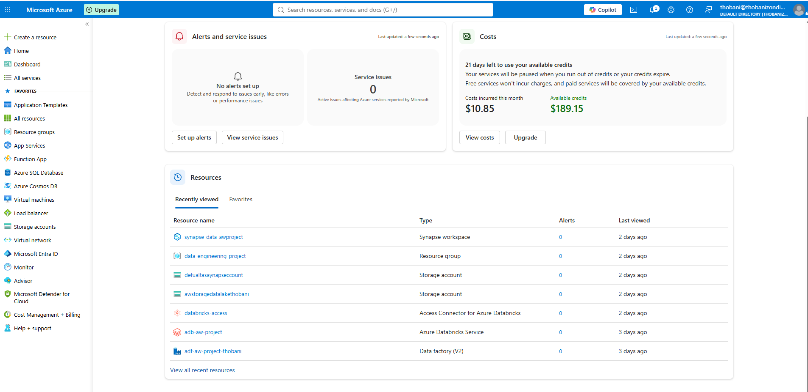
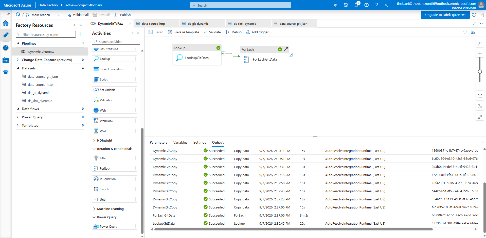
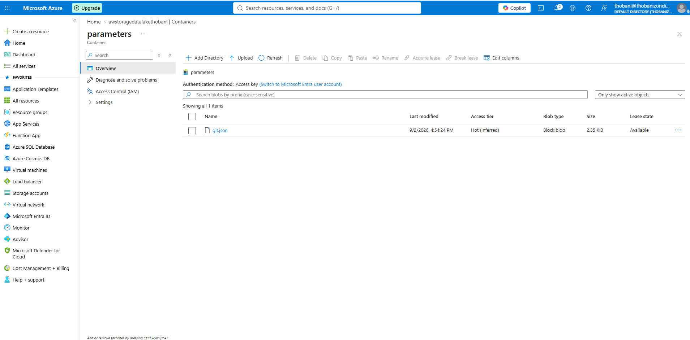
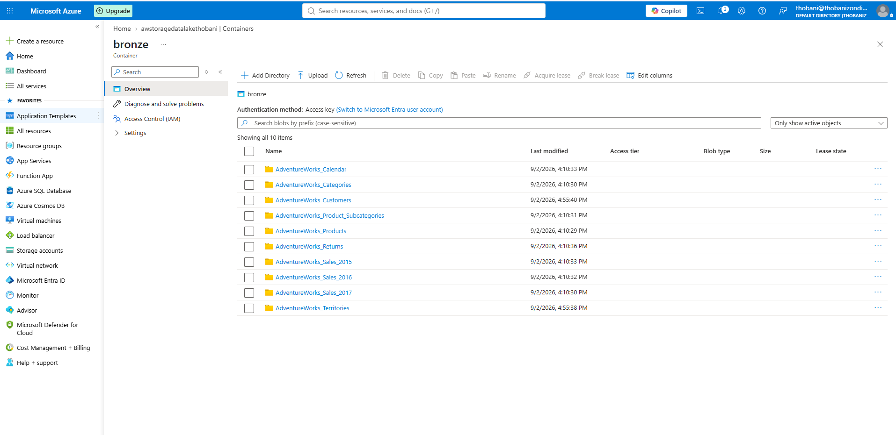
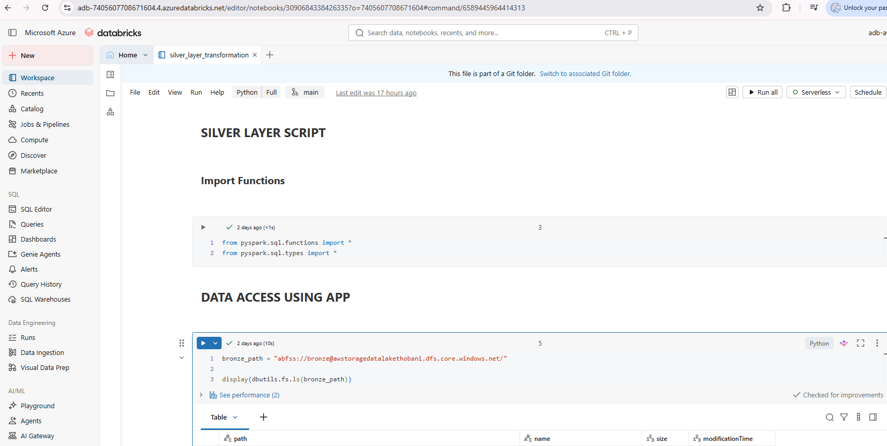
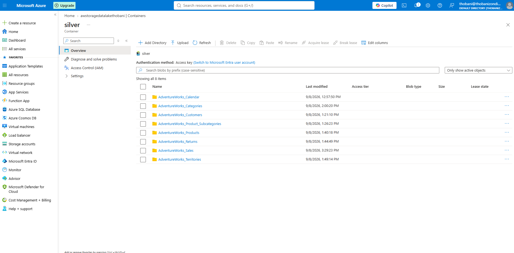
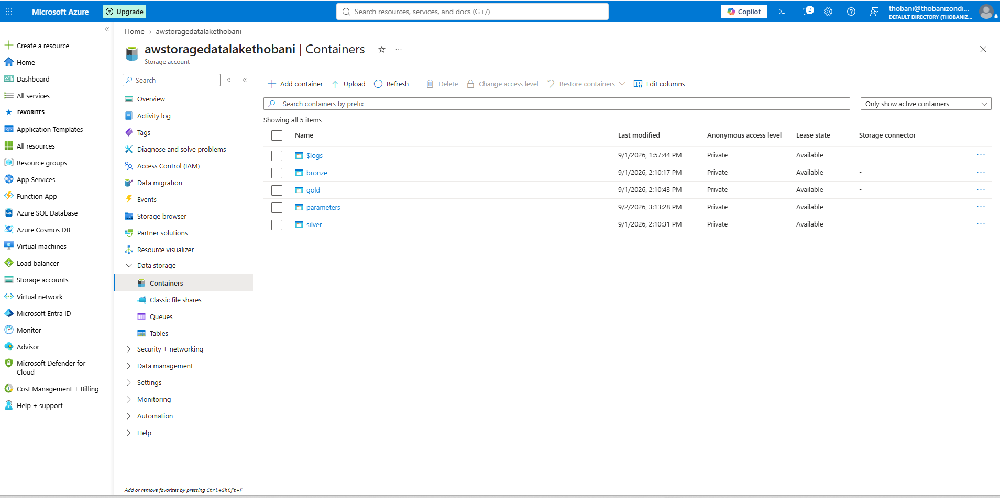

# Microsoft Azure End-to-End Data Engineering Pipeline

## Overview
This project is an end-to-end data engineering pipeline built on **Microsoft Azure**, following the **Medallion Architecture** (Bronze, Silver, Gold) using the **AdventureWorks** sales dataset. It demonstrates a complete cloud data flow, from raw ingestion through to analytics-ready reporting, using Azure's native data engineering and analytics services.

The pipeline ingests raw sales data with **Azure Data Factory**, lands it in **Azure Data Lake Storage Gen2** (Bronze), transforms and cleans it using **Azure Databricks (PySpark)** (Silver), and models it into analytics-ready datasets in **Azure Synapse Analytics** (Gold), ready for reporting through **Power BI**.

## Project Status
All three layers of the pipeline are built and working end to end on Azure:
- Bronze: live, populated with 10 AdventureWorks datasets ingested via Azure Data Factory.
- Silver: live, transformed via an Azure Databricks (PySpark) notebook.
- Gold: live, modelled as external tables and views in Azure Synapse Analytics.

Power BI reporting on top of the Gold layer is the remaining step.

## Table of Contents
- [Overview](#overview)
- [Project Status](#project-status)
- [Architecture](#architecture)
  - [Bronze Layer - Raw Ingestion](#bronze-layer---raw-ingestion)
  - [Silver Layer - Transformation](#silver-layer---transformation)
  - [Gold Layer - Analytics-Ready Modelling](#gold-layer---analytics-ready-modelling)
  - [Reporting](#reporting)
- [Technologies Used](#technologies-used)
- [Key Features](#key-features)
- [Data Source](#data-source)
- [Installation & Setup](#installation--setup)
  - [Prerequisites](#prerequisites)
  - [Steps to Reproduce](#steps-to-reproduce)
- [Future Enhancements](#future-enhancements)
- [Contributors](#contributors)

## Architecture

```
AdventureWorks Dataset (GitHub, retrieved via HTTPS)
        |
        v
Azure Data Factory  ----------->  Azure Data Lake Storage Gen2 (Bronze)
        (Ingestion)                     Raw, unprocessed data
                                            |
                                            v
                              Azure Databricks + PySpark (Silver)
                              Cleansed, validated, transformed data
                                            |
                                            v
                              Azure Synapse Analytics (Gold)
                              Analytics-ready, modelled data
                                            |
                                            v
                                       Power BI
                                  Reporting & Dashboards
```



### Bronze Layer - Raw Ingestion
Azure Data Factory pipelines retrieve the AdventureWorks sales dataset over HTTPS from GitHub and ingest it into Azure Data Lake Storage Gen2, landed in its raw, unmodified form.

Two ADF pipelines were built for this layer:
- **GitToRaw**: a straightforward single-file Copy Data pipeline.
- **DynamicGitToRaw**: a parameterized pipeline using a Lookup activity to read a JSON manifest of files (stored in a dedicated `parameters` container), followed by a ForEach activity that loops through the manifest and dynamically copies each file into Bronze.





The result is the Bronze container fully populated with all AdventureWorks source tables:



### Silver Layer - Transformation
An Azure Databricks notebook (PySpark), connected via Unity Catalog to the same Data Lake Storage Gen2 account (using an Access Connector, Storage Credential, and External Locations, with no storage account keys), reads the raw Bronze data, applies cleaning, validation, deduplication, and schema standardization, and writes the cleaned datasets back to Data Lake Gen2 in a structured, query-friendly format.



The cleaned output lands in the Silver container:



The storage account as a whole holds all Medallion layers as separate containers:



### Gold Layer - Analytics-Ready Modelling
Azure Synapse Analytics models the Silver data into curated, analytics-ready tables using external data sources, an external file format (Parquet), and external tables and views built on top of the Silver and Gold containers via a database-scoped credential backed by a managed identity.


Supports business-focused querying and reporting (e.g. sales performance, product, customer, and regional analysis).

### Reporting
Power BI connects to the Gold layer for interactive dashboards and business reporting.

## Technologies Used
- **Ingestion:** Azure Data Factory
- **Storage:** Azure Data Lake Storage Gen2
- **Governance:** Unity Catalog (Access Connector, Storage Credential, External Locations)
- **Transformation:** Azure Databricks, PySpark
- **Analytics & Modelling:** Azure Synapse Analytics (external tables, views, database-scoped credentials)
- **Reporting & Visualization:** Power BI
- **Dataset:** AdventureWorks Sales dataset (retrieved via HTTPS from GitHub)

## Key Features
- **Medallion Architecture** (Bronze to Silver to Gold) for clear separation of raw, cleansed, and curated data.
- **Dynamic, parameterized ingestion**: the DynamicGitToRaw pipeline reads a JSON manifest and loops through it with Lookup and ForEach activities, rather than hardcoding each file.
- **Keyless storage access**: Databricks connects to Data Lake Storage Gen2 through Unity Catalog (Access Connector and Storage Credential), with no storage account keys used anywhere in the pipeline.
- **Distributed transformation** using Azure Databricks and PySpark for efficient large-scale data processing.
- **Analytics-ready modelling** in Azure Synapse Analytics using external tables and views for fast, reliable querying.
- **End-to-end cloud-native workflow**, entirely built on Microsoft Azure services.
- **Business intelligence reporting** through Power BI, connected directly to curated Gold-layer data.

## Data Source
AdventureWorks Sales dataset, retrieved via HTTPS directly from GitHub (a widely used sample dataset for data engineering and analytics projects, representing a fictional bicycle manufacturer's sales, products, and customer data).

## Installation & Setup

### Prerequisites
- An active Azure subscription
- Azure Data Factory instance
- Azure Data Lake Storage Gen2 account
- Azure Databricks workspace (with Unity Catalog enabled)
- Azure Synapse Analytics workspace
- Power BI Desktop (for report development)

### Steps to Reproduce
1. Clone the repository:
   ```sh
   git clone https://github.com/thobanizondi/microsoft-azure-end-to-end-data-engineer-pipeline.git
   cd microsoft-azure-end-to-end-data-engineer-pipeline
   ```
2. Provision the required Azure resources (Data Factory, Data Lake Gen2, Databricks, Synapse Analytics).
3. In Azure, create an Access Connector for Azure Databricks, grant it the Storage Blob Data Contributor role on your Data Lake Storage Gen2 account, then in Databricks create a Storage Credential and External Locations for the bronze, silver, and gold containers.
4. In Azure Data Factory, configure the DynamicGitToRaw pipeline: a Lookup activity reading a JSON manifest of AdventureWorks files, and a ForEach activity that copies each file over HTTPS from GitHub into the Bronze container.
5. Run the pipeline to ingest the raw data into the Bronze layer.
6. Run the Databricks notebook to transform Bronze data into the Silver layer.
7. In Azure Synapse Analytics, create the database-scoped credential, external data sources, external file format, and external tables/views to model the Silver data into the Gold layer.
8. Connect Power BI to the Synapse Gold layer to build and view reports.

## Future Enhancements
- Automate pipeline orchestration and scheduling with Azure Data Factory triggers.
- Add data quality checks and validation at each layer (Bronze, Silver, Gold).
- Implement CI/CD for Databricks notebooks and Synapse artifacts via Azure DevOps.
- Add incremental/delta loading instead of full loads.
- Introduce monitoring and alerting for pipeline failures.
- Build out the Power BI report set on top of the Gold layer.

## Contributors
Developed by **Thobani Antony Zondi**
Contact: thobanizondi69@gmail.com
LinkedIn: [linkedin.com/in/thobani-zondi](https://linkedin.com/in/thobani-zondi)
